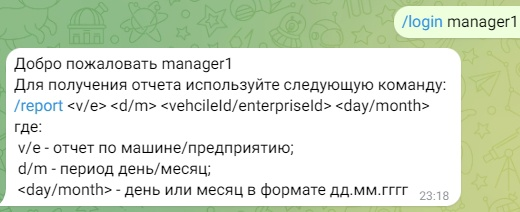

Autopark - это проект на Spring Boot для мониторинга и управления автомобилями на предприятиях. 
Архитектура проекта по паттерну MVC. Деплой приложения можно сделать с помощью файла deploy.bat, заменив переменные с сервером и учетной записью на свои. Сам делал деплой на VkCloud.

Технологический стек:
- Java 17;
- Spring Boot 3.2.1;
- Spring Security (+jsonwebtoken);
- Postgres 16 + PostGIS;
- Hibernate Spatial;
- Gatling (нагрузочное тестирование);
- Docker;
- Thymeleaf;
- Telegrambots;
- Prometheus, Grafana;
- Openrouteservice (маршруты)

Возможности:
- учетные записи менеджеров и обычных пользователей;
- просмотр списка предприятий, автомобилей, водителей с детальной информацией по каждому пункту;

- просмотр маршрутов + отрисовка на картах;

- назначение водителей, автомобилей;
- добавление/удаление новых автомобилей, водителей;
- просмотр и генерация отчетов по автомобилям;

- просмотр отчетов через Telegram-бот;

  
- просмотр метрик на Grafana;